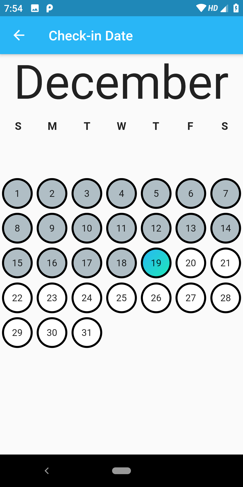

# calendar_package

A widget that can be added to any page that has 2 buttons which individually open a calendar page to select 2 different dates. Useful in apps to book flight/train tickets or book hotel rooms. Works on iOS, Android, Web, and MacOS.

### Show me some :heart: and star this repo to support the project.

### Screenshots
 

## Usage

[Example] (https://github.com/imaachman/Flutter-Calendar-Package/blob/master/example/Example.dart)

To use this package: 
* add this dependency to your [pubspec.yaml] (https://github.com/imaachman/Flutter-Calendar-Package/blob/master/example/pubspec.yaml)

```yaml
    dependencies:
        flutter:
            sdk: flutter
        calendar_package:
```

### How to use

```dart

// DateSelectionWidget() can only be used with stateful widgets to support state changes in dates

class HomePage extends StatefulWidget {  
  @override
  _HomePageState createState() => _HomePageState();
}

class _HomePageState extends State<HomePage> {

    // to access the dates an instance of CalendarBloc class should be made

  final CalendarBloc _calendarBloc = CalendarBloc();

  @override
  Widget build(BuildContext context) {
    return Scaffold(
      floatingActionButton: FloatingActionButton(
        onPressed: (){
            
            // day, month and year can be accessed by calling calendarList which :- index 0 is startDate and index 1 is endDate

          print(_calendarBloc.calendarList[0].day); print(_calendarBloc.calendarList[0].month); print(_calendarBloc.calendarList[0].year);
          print(_calendarBloc.calendarList[1].day); print(_calendarBloc.calendarList[1].month); print(_calendarBloc.calendarList[1].year);
        },
        backgroundColor: Colors.red,
      ),
      appBar: AppBar(),
      body: DateSelectionWidget() //DateSelectionWidget() returns a container and should be used as one!
    );
  }

  // if you want to use just the calendar page, you can use the CalendarPage() class

```


## Getting Started

This project is a starting point for a Dart
[package](https://flutter.dev/developing-packages/),
a library module containing code that can be shared easily across
multiple Flutter or Dart projects.

For help getting started with Flutter, view our 
[online documentation](https://flutter.dev/docs), which offers tutorials, 
samples, guidance on mobile development, and a full API reference.


